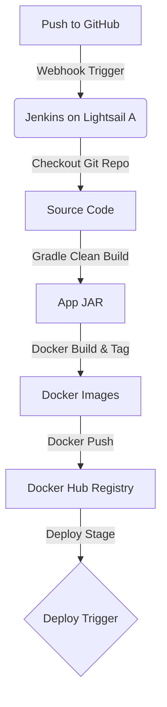
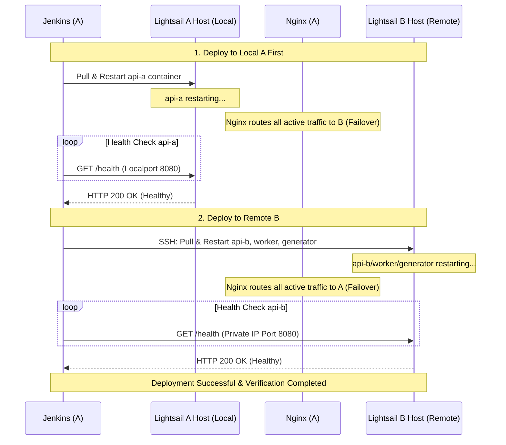

# Jenkins CI/CD & Docker Compose Rolling Deployment Design Spec

> [!NOTE]
> **Architecture Decision Record (ADR) - 2026-06-05**
> * **Status:** Deferred (Kubernetes Migration Phase)
> * **Decision:** Retain the optimized Docker Compose + Nginx Active Failover architecture and defer the Kubernetes (K3s) migration.
> * **Rationale:** The AWS Lightsail instances A and B are limited to 2GB of physical RAM. Running the K3s control plane (master process, kubelet, flannel, etc.) alongside the Jenkins automation server, Spring Boot API, and Nginx proxy would lead to extreme memory resource contention, causing heavy disk swap usage and potential Out-Of-Memory (OOM) daemon terminations. Retaining Docker Compose ensures stable, low-overhead resource utilization while achieving identical zero-downtime rolling deployment guarantees.

This document specifies the design for setting up a Jenkins CI/CD pipeline on AWS Lightsail instance A to build, push to Docker Hub, and perform zero-downtime rolling deployments to Lightsail instances A and B. It also establishes the migration blueprint for transitioning the infrastructure to a Kubernetes cluster (retained as a deferred Phase 2 goal).

## 1. Goal and Constraints

- **Primary Goal**: Automate the build and deployment process using Jenkins on the existing Lightsail A instance. Ensure zero-downtime deployments with failover and proper resource limits.
- **Secondary Goal**: Prepare the project configuration and architecture for easy migration to a Kubernetes (K3s/MicroK8s) cluster.
- **Constraints**:
  - **Memory Limits**: Lightsail instance A has limited physical RAM (~1GB or 2GB). Jenkins and Spring Boot JVM processes must be memory-limited.
  - **Stability**: Prevent Out-Of-Memory (OOM) crashes on Lightsail instance A.
  - **Zero-Downtime**: Rolling updates must prevent 502/503/504 gateway errors for clients during redeployments.

---

## 2. Infrastructure Setup (Phase 1)

### 2.1 SWAP Space Allocation on Lightsail A
To prevent the OS OOM killer from terminating Jenkins or the `api-a` Spring Boot application, we will allocate **2GB of swap space** on Lightsail A.

**Configuration steps**:
```bash
sudo fallocate -l 2G /swapfile
sudo chmod 600 /swapfile
sudo mkswap /swapfile
sudo swapon /swapfile
# Persist in /etc/fstab:
echo '/swapfile none swap sw 0 0' | sudo tee -a /etc/fstab
```

### 2.2 Dockerized Jenkins with Host Docker Access (Docker-out-of-Docker)
We will run Jenkins inside a Docker container on Lightsail A. To allow Jenkins to build and run docker containers on the host machine, we mount the host's Docker socket `/var/run/docker.sock`.

- **Jenkins Service Definition (`infra/prod/lightsail-a.compose.yml` update)**:
  We will add a `jenkins` service with:
  - Memory limit (`mem_limit: 1g`).
  - JVM memory limits: `JAVA_OPTS="-Xmx512m -XX:MaxRAMPercentage=50.0"`.
  - Bind mounts: `/var/run/docker.sock` to access host docker.
  - Bind mounts: `jenkins_home` volume to persist pipeline settings and credentials.

---

## 3. Pipeline Flow & Docker Hub Integration (CI)



### 3.1 Gradle Build Caching and JVM Optimization
To minimize build times and memory consumption on the small host VM:
1. **Cached Gradle Volume**: Jenkins will mount a local cache directory (e.g., `~/.gradle` on host) to speed up dependency resolution across builds.
2. **Gradle JVM Memory Cap**: Run builds with limited heap to avoid memory spikes:
   ```bash
   ./gradlew bootJar -Dorg.gradle.jvmargs="-Xmx512m -XX:MaxMetaspaceSize=256m" --no-daemon
   ```
3. **Docker Image Build**: Copy the pre-built `app.jar` into the Docker context instead of running Gradle inside the Docker build step.

### 3.2 Image Tagging
- Tag format: `chocojipsa/timedeal-backend:latest` and `chocojipsa/timedeal-backend:${BUILD_NUMBER}` (or git SHA).
- Credentials stored in Jenkins Credentials manager as `docker-hub-credentials`.

---

## 4. CD Rolling Update Pipeline (CD)

To ensure zero downtime, the deployment will run sequentially (Local Lightsail A first, then Remote Lightsail B). Nginx load balances traffic between both instances.



### 4.1 Step 1: Lightsail A Deployment (Local)
Jenkins updates its local container using the host's Docker engine socket:
```bash
docker compose -f infra/prod/lightsail-a.compose.yml pull api-a
docker compose -f infra/prod/lightsail-a.compose.yml up -d --no-deps api-a
```
Jenkins polls `http://localhost:8080/health` (or internal endpoint) until it returns `200 OK`.

### 4.2 Step 2: Lightsail B Deployment (Remote SSH)
Using SSH credentials over the internal Lightsail VPC private network (`172.26.4.84`), Jenkins updates Lightsail B:
```bash
ssh -o StrictHostKeyChecking=no ubuntu@172.26.4.84 \
  "cd ~/simulation/infra/prod && \
   docker compose -f lightsail-b.compose.yml pull api-b worker traffic-generator && \
   docker compose -f lightsail-b.compose.yml up -d --no-deps api-b worker traffic-generator"
```
Jenkins polls `http://172.26.4.84:8080/health` until it returns `200 OK`.

---

## 5. Nginx Active Failover & Resiliency

To prevent 502/503/504 errors on Nginx while containers are restarting or experiencing temporary downtime, we configure dynamic failover in `nginx-api.conf`:

1. **Upstream Failover Boundaries**:
   Configure `max_fails=1` and `fail_timeout=10s` for upstream servers. Nginx will mark a server as temporarily dead if a single request fails, bypassing it for 10 seconds.
   ```nginx
   upstream api_servers {
     server api-a:8080 max_fails=1 fail_timeout=10s;
     server 172.26.4.84:8080 max_fails=1 fail_timeout=10s;
   }
   ```
2. **Transparent Retries**:
   Configure `proxy_next_upstream` inside location blocks. If Nginx gets a failure or a 502/503/504 gateway response from one upstream, it transparently forwards the request to the other upstream without exposing the error to the user:
   ```nginx
   location /api/ {
     proxy_pass http://api_servers;
     proxy_next_upstream error timeout http_502 http_503 http_504;
     # ... CORS and other proxy settings ...
   }
   ```

---

## 6. Future Kubernetes Migration Blueprint (Phase 2 - Deferred)

> [!IMPORTANT]
> This phase is currently **deferred** due to the 2GB RAM resource limitations on Lightsail instances A, B, and C, in favor of the lightweight Docker Compose + Nginx Active Failover setup. The blueprint is retained below for future scalability planning once the hardware resources are scaled up (e.g., minimum 4GB RAM on Node A).

Once Jenkins CI/CD with Docker Hub is stable, migrating to Kubernetes (K3s) will follow this roadmap:

1. **Cluster Setup**: Provision a lightweight K3s cluster across the 3 Lightsail nodes. Node A acts as the control plane (Master).
2. **K8s Manifests Creation**: Write YAML manifests for:
   - Deployments: `api` (replicas: 2), `worker` (replicas: 1), `traffic-generator` (replicas: 1).
   - StatefulSets: `redis`, `kafka` (or continue using separate compose files/managed services if preferred).
   - Ingress: Nginx Ingress Controller on Node A to replace the standalone Nginx docker container.
3. **Jenkins CD Evolution**:
   - The Jenkins CI workflow (Gradle build -> Docker image tag -> Push to Docker Hub) remains 100% unchanged.
   - The CD stage changes from SSH Docker Compose command to `kubectl` execution:
     ```groovy
     sh "kubectl set image deployment/api api-container=chocojipsa/timedeal-backend:${BUILD_NUMBER}"
     sh "kubectl rollout status deployment/api"
     ```
   - Kubernetes native rolling updates will handle node failure, readiness checks, and failovers out-of-the-box.
