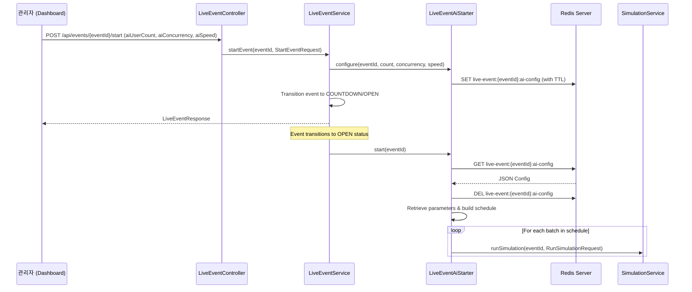

# Configurable AI Simulation Design Spec

This specification outlines the design and implementation details for allowing the user to configure the AI participant count, concurrency level, and batch speed directly from the Live Console (Dashboard) before starting the event.

## 1. Context & Motivation

Currently, when the administrator starts an event from the dashboard, the backend triggers the AI user generation automatically using fixed properties:
* `live-event.ai-user-count` (default: 150)
* `live-event.ai.concurrency` (default: 50)
* Batch interval delay is hardcoded to 500ms in `AiBatchSchedule.defaultSchedule`.

To allow dynamic load testing, we want to expose these settings directly on the dashboard's control header before starting the event. 
Since the live event metadata is stored in Redis/In-memory databases (`LiveEventMetadata`), modifying its database schema just to hold transient parameters is high-risk and violates separation of concerns. Instead, we will store the custom configuration transiently in the `LiveEventAiStarter` Spring service during the start transaction.

To ensure consistency in a multi-instance production environment (where Nginx round-robins `/start` and `/snapshot` requests between `api-a` and `api-b`), we will cache the transient AI settings in **Redis** with a 10-minute expiration. If Redis is unavailable (e.g. in unit tests), the service will automatically fall back to using a local `ConcurrentHashMap` cache.

Furthermore, the existing batch scheduling logic uses a hardcoded prefix list of sizes (`10, 15, 20, 25, 30` users), resulting in a massive sudden spike in the final batch for larger user counts (e.g., dumping 900 users all at once at the 6th step if user count is 1000). We will fix this by converting the batching sizes to proportional percentages (`10%, 15%, 20%, 25%, 30%` of the total user count), producing a smooth, gradual load curve for any target user count.

---

## 2. Proposed Architecture

### 2.1 Backend Changes

#### A. Request Model (`StartEventRequest.java`)
Create a new request record to parse the start event configurations:
```java
package com.timedeal.seatreservation.event;

public record StartEventRequest(
        Integer aiUserCount,
        Integer aiConcurrency,
        String aiSpeed
) {}
```

#### B. API Controller (`LiveEventController.java`)
Modify `/api/events/{eventId}/start` to accept an optional request body:
```java
    @PostMapping("/{eventId}/start")
    public LiveEventResponse startEvent(
            @PathVariable UUID eventId,
            @RequestBody(required = false) StartEventRequest request
    ) {
        return liveEventService.startEvent(eventId, request);
    }
```

#### C. Service Layer (`LiveEventService.java`)
Update `startEvent` to store configurations in the AI starter before starting the event countdown:
```java
    public LiveEventResponse startEvent(UUID eventId, StartEventRequest request) {
        ensureExpectedEvent(eventId);
        LiveEventMetadata metadata = eventStateStore.getOrCreate(eventId, now());
        if (metadata.statusAt(now()) != LiveEventStatus.READY) {
            throw new IllegalStateException("Event already started or ended");
        }
        
        if (request != null && aiStarter != null) {
            aiStarter.configure(eventId, request.aiUserCount(), request.aiConcurrency(), request.aiSpeed());
        }
        
        LiveEventMetadata started = eventStateStore.startCountdown(eventId, now(), countdownDuration, openWindow);
        triggerAiIfOpen(started);
        return response(started);
    }
```

#### D. AI Starter Service (`LiveEventAiStarter.java`)
Add Redis-caching with dynamic fallbacks to build the batch schedule:
```java
    private final java.util.concurrent.ConcurrentHashMap<UUID, AiConfig> localConfigs = new java.util.concurrent.ConcurrentHashMap<>();
    private final org.springframework.data.redis.core.RedisTemplate<String, String> redisTemplate;
    private final com.fasterxml.jackson.databind.ObjectMapper objectMapper;

    public record AiConfig(int participantCount, int concurrency, String speed) {}

    @org.springframework.beans.factory.annotation.Autowired
    public LiveEventAiStarter(
            SimulationService simulationService,
            @org.springframework.beans.factory.annotation.Value("${live-event.ai-user-count:150}") int participantCount,
            @org.springframework.beans.factory.annotation.Value("${live-event.ai.concurrency:50}") int concurrency,
            org.springframework.beans.factory.ObjectProvider<org.springframework.data.redis.core.RedisTemplate<String, String>> redisTemplateProvider,
            com.fasterxml.jackson.databind.ObjectMapper objectMapper
    ) {
        this(
                simulationService,
                participantCount,
                concurrency,
                new ExecutorBatchScheduler(Executors.newSingleThreadScheduledExecutor()),
                redisTemplateProvider.getIfAvailable(),
                objectMapper
        );
    }

    LiveEventAiStarter(
            SimulationService simulationService,
            int participantCount,
            int concurrency,
            BatchScheduler scheduler,
            org.springframework.data.redis.core.RedisTemplate<String, String> redisTemplate,
            com.fasterxml.jackson.databind.ObjectMapper objectMapper
    ) {
        this.simulationService = simulationService;
        this.participantCount = participantCount;
        this.concurrency = concurrency;
        this.scheduler = scheduler;
        this.redisTemplate = redisTemplate;
        this.objectMapper = objectMapper;
    }

    public void configure(UUID eventId, Integer participantCount, Integer concurrency, String speed) {
        if (participantCount == null && concurrency == null && speed == null) return;
        
        int count = participantCount != null ? Math.max(0, Math.min(1000, participantCount)) : this.participantCount;
        int maxConcurrency = concurrency != null ? Math.max(1, Math.min(120, concurrency)) : this.concurrency;
        String normalizedSpeed = speed != null ? speed.toUpperCase() : "NORMAL";
        
        AiConfig config = new AiConfig(count, maxConcurrency, normalizedSpeed);
        
        if (redisTemplate != null) {
            try {
                String json = objectMapper.writeValueAsString(config);
                redisTemplate.opsForValue().set("live-event:" + eventId + ":ai-config", json, java.time.Duration.ofMinutes(10));
            } catch (Exception e) {
                localConfigs.put(eventId, config);
            }
        } else {
            localConfigs.put(eventId, config);
        }
    }

    public AiConfig getCachedConfig(UUID eventId) {
        if (redisTemplate != null) {
            try {
                String json = redisTemplate.opsForValue().get("live-event:" + eventId + ":ai-config");
                if (json != null) {
                    return objectMapper.readValue(json, AiConfig.class);
                }
            } catch (Exception ignored) {}
        }
        return localConfigs.get(eventId);
    }
```
Update `start(UUID eventId)` to read from Redis (or fallback to local configs), clean up, translate speeds, and build the schedule:
```java
    public void start(UUID eventId) {
        AiConfig config = null;
        if (redisTemplate != null) {
            try {
                String json = redisTemplate.opsForValue().get("live-event:" + eventId + ":ai-config");
                if (json != null) {
                    config = objectMapper.readValue(json, AiConfig.class);
                    redisTemplate.delete("live-event:" + eventId + ":ai-config");
                }
            } catch (Exception ignored) {}
        }
        if (config == null) {
            config = localConfigs.remove(eventId);
        }
        
        int count = config != null ? config.participantCount() : this.participantCount;
        int maxConcurrency = config != null ? config.concurrency() : this.concurrency;
        String speed = config != null ? config.speed() : "NORMAL";
        
        Duration interval;
        if ("FAST".equals(speed)) {
            interval = Duration.ofMillis(100);
        } else if ("SLOW".equals(speed)) {
            interval = Duration.ofMillis(1500);
        } else {
            interval = Duration.ofMillis(500);
        }

        AiBatchSchedule schedule = buildCustomSchedule(count, maxConcurrency, interval);
        for (AiBatch batch : schedule.batches()) {
            scheduler.schedule(batch.delay(), () -> simulationService.runSimulation(
                    eventId,
                    new RunSimulationRequest(batch.participantCount(), batch.concurrency())
            ));
        }
    }

    private AiBatchSchedule buildCustomSchedule(int participantCount, int maxConcurrency, Duration interval) {
        int remaining = Math.max(0, participantCount);
        int normalizedConcurrency = Math.max(1, maxConcurrency);
        double[] batchPercentages = {0.10, 0.15, 0.20, 0.25, 0.30};
        long delayMillis = interval.toMillis();
        java.util.ArrayList<AiBatch> batches = new java.util.ArrayList<>();
        
        for (double pct : batchPercentages) {
            if (remaining <= 0) break;
            int count = (int) Math.round(participantCount * pct);
            count = Math.min(count, remaining);
            if (count <= 0) continue;
            
            int concurrency = Math.min(normalizedConcurrency, count);
            batches.add(new AiBatch(count, concurrency, Duration.ofMillis(delayMillis)));
            remaining -= count;
            delayMillis += interval.toMillis();
        }
        if (remaining > 0) {
            int concurrency = Math.min(normalizedConcurrency, remaining);
            batches.add(new AiBatch(remaining, concurrency, Duration.ofMillis(delayMillis)));
        }
        return new AiBatchSchedule(List.copyOf(batches));
    }
```

---

### 2.2 Frontend Changes

No changes are required in the frontend since the existing payload and toolbar format are fully compliant with the request parameters.

---

## 3. Data Flow Diagram



---

## 4. Verification & Testing Plan

1. **Unit Tests**:
   * Add a test in `LiveEventAiStarterTest` verifying that the service correctly uses the local cache fallback when `redisTemplate` is null.
   * Add a test verifying that when `redisTemplate` is present, it correctly writes to and reads from Redis.
2. **Type Checking & Linting**:
   * Run `./gradlew compileJava compileTestJava` for the backend.
