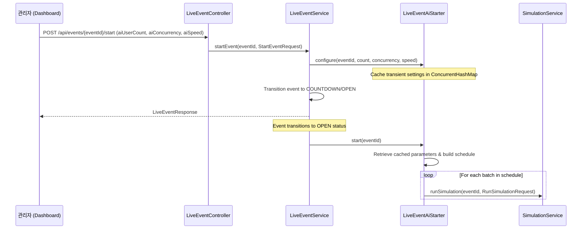

# Configurable AI Simulation Design Spec

This specification outlines the design and implementation details for allowing the user to configure the AI participant count, concurrency level, and batch speed directly from the Live Console (Dashboard) before starting the event.

## 1. Context & Motivation

Currently, when the administrator starts an event from the dashboard, the backend triggers the AI user generation automatically using fixed properties:
* `live-event.ai-user-count` (default: 150)
* `live-event.ai.concurrency` (default: 50)
* Batch interval delay is hardcoded to 500ms in `AiBatchSchedule.defaultSchedule`.

To allow dynamic load testing, we want to expose these settings directly on the dashboard's control header before starting the event. 
Since the live event metadata is stored in Redis/In-memory databases (`LiveEventMetadata`), modifying its database schema just to hold transient parameters is high-risk and violates separation of concerns. Instead, we will store the custom configuration transiently in the `LiveEventAiStarter` Spring service during the start transaction.

---

## 2. Proposed Architecture

### 2.1 Backend Changes

#### A. Request Model (`StartEventRequest.java`)
Create a new request record to parse the start event configurations:
```java
package com.timedeal.seatreservation.event;

public record StartEventRequest(
        Integer aiUserCount,
        Integer aiConcurrency,
        String aiSpeed
) {}
```

#### B. API Controller (`LiveEventController.java`)
Modify `/api/events/{eventId}/start` to accept an optional request body:
```java
    @PostMapping("/{eventId}/start")
    public LiveEventResponse startEvent(
            @PathVariable UUID eventId,
            @RequestBody(required = false) StartEventRequest request
    ) {
        return liveEventService.startEvent(eventId, request);
    }
```

#### C. Service Layer (`LiveEventService.java`)
Update `startEvent` to store configurations in the AI starter before starting the event countdown:
```java
    public LiveEventResponse startEvent(UUID eventId, StartEventRequest request) {
        ensureExpectedEvent(eventId);
        LiveEventMetadata metadata = eventStateStore.getOrCreate(eventId, now());
        if (metadata.statusAt(now()) != LiveEventStatus.READY) {
            throw new IllegalStateException("Event already started or ended");
        }
        
        if (request != null && aiStarter != null) {
            aiStarter.configure(eventId, request.aiUserCount(), request.aiConcurrency(), request.aiSpeed());
        }
        
        LiveEventMetadata started = eventStateStore.startCountdown(eventId, now(), countdownDuration, openWindow);
        triggerAiIfOpen(started);
        return response(started);
    }
```

#### D. AI Starter Service (`LiveEventAiStarter.java`)
Add a thread-safe registry to cache parameters for the event initialization and dynamically build the batch schedule:
```java
    private final java.util.concurrent.ConcurrentHashMap<UUID, AiConfig> customConfigs = new java.util.concurrent.ConcurrentHashMap<>();

    public record AiConfig(int participantCount, int concurrency, String speed) {}

    public void configure(UUID eventId, Integer participantCount, Integer concurrency, String speed) {
        if (participantCount == null && concurrency == null && speed == null) return;
        
        // Enforce safe boundaries on the backend
        int count = participantCount != null ? Math.max(0, Math.min(1000, participantCount)) : this.participantCount;
        int maxConcurrency = concurrency != null ? Math.max(1, Math.min(120, concurrency)) : this.concurrency;
        String normalizedSpeed = speed != null ? speed.toUpperCase() : "NORMAL";
        
        customConfigs.put(eventId, new AiConfig(count, maxConcurrency, normalizedSpeed));
    }
```
Update `start(UUID eventId)` to read from the registry, fallback to defaults, translate speeds, and build the schedule:
```java
    public void start(UUID eventId) {
        AiConfig config = customConfigs.remove(eventId);
        int count = config != null ? config.participantCount() : this.participantCount;
        int maxConcurrency = config != null ? config.concurrency() : this.concurrency;
        String speed = config != null ? config.speed() : "NORMAL";
        
        Duration interval;
        if ("FAST".equals(speed)) {
            interval = Duration.ofMillis(100);
        } else if ("SLOW".equals(speed)) {
            interval = Duration.ofMillis(1500);
        } else {
            interval = Duration.ofMillis(500);
        }

        AiBatchSchedule schedule = buildCustomSchedule(count, maxConcurrency, interval);
        for (AiBatch batch : schedule.batches()) {
            scheduler.schedule(batch.delay(), () -> simulationService.runSimulation(
                    eventId,
                    new RunSimulationRequest(batch.participantCount(), batch.concurrency())
            ));
        }
    }

    private AiBatchSchedule buildCustomSchedule(int participantCount, int maxConcurrency, Duration interval) {
        int remaining = Math.max(0, participantCount);
        int normalizedConcurrency = Math.max(1, maxConcurrency);
        int[] batchSizes = {10, 15, 20, 25, 30};
        long delayMillis = interval.toMillis();
        java.util.ArrayList<AiBatch> batches = new java.util.ArrayList<>();
        
        for (int batchSize : batchSizes) {
            if (remaining <= 0) break;
            int count = Math.min(batchSize, remaining);
            int concurrency = Math.min(normalizedConcurrency, count);
            batches.add(new AiBatch(count, concurrency, Duration.ofMillis(delayMillis)));
            remaining -= count;
            delayMillis += interval.toMillis();
        }
        if (remaining > 0) {
            int concurrency = Math.min(normalizedConcurrency, remaining);
            batches.add(new AiBatch(remaining, concurrency, Duration.ofMillis(delayMillis)));
        }
        return new AiBatchSchedule(List.copyOf(batches));
    }
```

---

### 2.2 Frontend Changes

#### A. API Client (`liveEventApi.ts` & `useLiveEventRoom.ts`)
* Add parameter interface:
```typescript
export interface StartEventRequest {
  aiUserCount?: number;
  aiConcurrency?: number;
  aiSpeed?: 'SLOW' | 'NORMAL' | 'FAST';
}
```
* Update `startEvent` to post with the request body:
```typescript
export async function startEvent(
  apiBaseUrl: string,
  eventId: string,
  request?: StartEventRequest
): Promise<LiveEventResponse> {
  return readJson(await fetch(`${apiBaseUrl}/api/events/${eventId}/start`, {
    method: 'POST',
    headers: { 'Content-Type': 'application/json' },
    body: JSON.stringify(request || {}),
  }));
}
```
* Update `useLiveEventRoom.ts` `start` method to accept this request:
```typescript
  const start = useCallback(async (request?: StartEventRequest) => {
    if (!eventId) return;
    await startEvent(apiBaseUrl, eventId, request);
    await refresh();
  }, [apiBaseUrl, eventId, refresh]);
```

#### B. Dashboard Header Controls (`EventHeader.tsx`)
* Define state variables inside `EventHeader` for configurations:
```typescript
  const [aiCount, setAiCount] = useState<number>(150);
  const [aiConcurrency, setAiConcurrency] = useState<number>(50);
  const [aiSpeed, setAiSpeed] = useState<'SLOW' | 'NORMAL' | 'FAST'>('NORMAL');
```
* Under `READY` status, display inline inputs:
```html
<div className="ai-config-toolbar">
  <div className="input-group">
    <label htmlFor="ai-count-input">AI 유저 수</label>
    <input 
      id="ai-count-input"
      type="number" 
      min={0} 
      max={1000} 
      value={aiCount} 
      onChange={(e) => setAiCount(Math.max(0, Math.min(1000, parseInt(e.target.value) || 0)))} 
    />
  </div>
  <div className="input-group">
    <label htmlFor="ai-concurrency-input">동시성</label>
    <input 
      id="ai-concurrency-input"
      type="number" 
      min={1} 
      max={120} 
      value={aiConcurrency} 
      onChange={(e) => setAiConcurrency(Math.max(1, Math.min(120, parseInt(e.target.value) || 1)))} 
    />
  </div>
  <div className="input-group">
    <label htmlFor="ai-speed-select">투입 속도</label>
    <select 
      id="ai-speed-select"
      value={aiSpeed} 
      onChange={(e) => setAiSpeed(e.target.value as any)}
    >
      <option value="SLOW">느림 (1.5초 간격)</option>
      <option value="NORMAL">보통 (0.5초 간격)</option>
      <option value="FAST">빠름 (0.1초 간격)</option>
    </select>
  </div>
  <button 
    className="header-action" 
    onClick={() => onStart({ aiUserCount: aiCount, aiConcurrency: aiConcurrency, aiSpeed: aiSpeed })}
  >
    이벤트 시작하기
  </button>
</div>
```

---

## 3. Data Flow Diagram



---

## 4. Verification & Testing Plan

1. **Unit Tests**:
   * Add test case to `LiveEventServiceTest` and `LiveEventAiStarterTest` verifying that custom AI configurations are correctly applied during start.
2. **Type Checking & Linting**:
   * Run `./gradlew compileJava compileTestJava` for the backend.
   * Run `npx tsc --noEmit` in the `frontend` directory.
