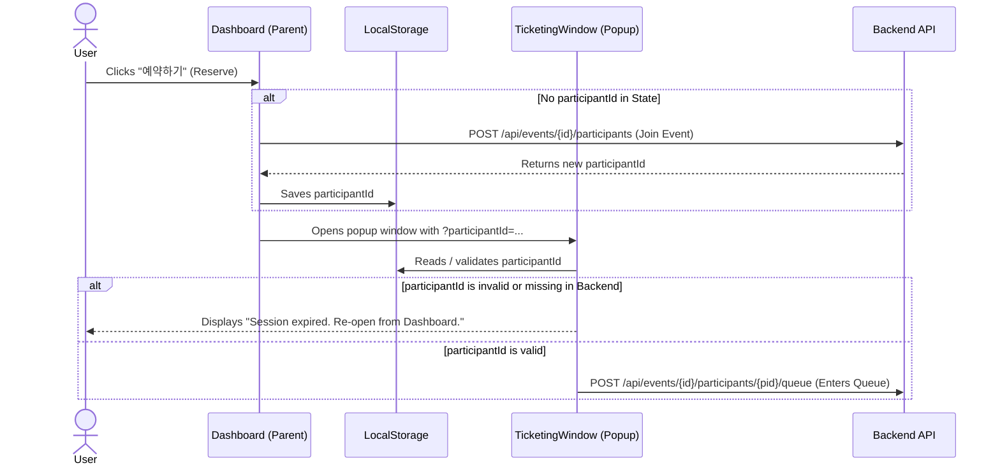

# Design Specification: Session Management & AI Sequential Naming Fix

## 1. Overview
This design document specifies the architecture and implementation details for resolving two key issues in the ticketing simulation system:
1. **Dual Human Session Issue**: A single human user occupies two participant slots in the active admission pool (one for the main Dashboard console and one for the Ticketing Window popup), blocking AI participants due to concurrency limitations.
2. **Duplicate AI Names**: AI virtual users are spawned with duplicate display names (e.g. multiple `AI-1` to `AI-15` instances) because batch scheduling restarts virtual user numbering from 1.

---

## 2. Goals & Success Criteria
- A single human user must only occupy **exactly one** participant session across both the Dashboard and Ticketing Window.
- The Dashboard must serve as the single source of truth for session creation (joining the event). The Ticketing Window must reuse the session created by the Dashboard and never spawn its own new session.
- AI virtual users must have sequential, non-overlapping names (e.g. `AI-1` to `AI-150` for a 150-user run) across all scheduled batches.
- Concurrency calculations in the backend must accurately reflect active admissions without being artificially inflated by redundant sessions.

---

## 3. Detailed Design

### 3.1. Front-end: Single Responsibility Session Management

We will restructure the session lifecycle so that the **Dashboard** is solely responsible for creating (joining) a participant session.



#### Files to Modify:
1. **[Dashboard.tsx](file:///mnt/c/users/kwon/desktop/workspace/timedeal/frontend/src/Dashboard.tsx)**:
   - Modify `openTicketingWindow` to be an `async` function.
   - If the user is not joined (no `room.participantId`), join first using `await room.join(randomGuestName())` to acquire a valid ID.
   - Open the popup with the URL containing the participantId as a query param: `/ticketing/${room.eventId}?participantId=${participantId}`.

2. **[useLiveEventRoom.ts](file:///mnt/c/users/kwon/desktop/workspace/timedeal/frontend/src/hooks/useLiveEventRoom.ts)**:
   - Add a `storage` event listener to sync `participantId` React state dynamically when it changes in other windows/tabs:
     ```typescript
     useEffect(() => {
       const handleStorageChange = (e: StorageEvent) => {
         if (e.key === participantStorageKey) {
           setParticipantId(e.newValue);
         }
       };
       window.addEventListener('storage', handleStorageChange);
       return () => window.removeEventListener('storage', handleStorageChange);
     }, []);
     ```

3. **[TicketingWindow.tsx](file:///mnt/c/users/kwon/desktop/workspace/timedeal/frontend/src/components/TicketingWindow.tsx)**:
   - In `initSession`, parse the `participantId` from the URL query parameters using `URLSearchParams` or fall back to `localStorage`.
   - Remove the `autoJoinAndQueue` fallback which calls `joinEvent`.
   - If the session ID is missing or if the backend returns `404` / `400` indicating the participant does not exist (e.g. after a simulation reset), set an error state: `"세션이 존재하지 않거나 만료되었습니다. 대시보드 화면에서 '예약하기' 버튼을 다시 눌러주세요."` and do not allow the user to proceed.

---

### 3.2. Back-end: AI Batch Offset Propagation

We will add a cumulative offset to each simulation batch so that `TrafficGeneratorService` can offset the naming index.

#### Files to Modify:
1. **`RunSimulationRequest.java` / `StartAiParticipantsRequest.java`**:
   - Add a `virtualUserOffset` (defaulting to 0) to the request records.

2. **[LiveEventAiStarter.java](file:///mnt/c/users/kwon/desktop/workspace/timedeal/backend/src/main/java/com/timedeal/seatreservation/event/LiveEventAiStarter.java)**:
   - Keep a running sum of scheduled participants in `buildCustomSchedule` and assign the offset to each batch:
     - Batch 1: count = 15, offset = 0
     - Batch 2: count = 22, offset = 15
     - Batch 3: count = 30, offset = 37
     - etc.
   - Pass this offset when calling `simulationService.runSimulation`:
     ```java
     simulationService.runSimulation(eventId, new RunSimulationRequest(batch.participantCount(), batch.concurrency(), batch.offset()))
     ```

3. **[TrafficGeneratorService.java](file:///mnt/c/users/kwon/desktop/workspace/timedeal/backend/src/main/java/com/timedeal/seatreservation/generator/TrafficGeneratorService.java)**:
   - In `runSimulation`, start the virtual user numbering at `request.virtualUserOffset() + number` rather than `number`.
     ```java
     for (int number = 1; number <= request.virtualUserCount(); number++) {
         int virtualUserNumber = request.virtualUserOffset() + number;
         executor.submit(() -> runVirtualUser(simulationId, virtualUserNumber));
     }
     ```

4. **[HttpVirtualUserHttpClient.java](file:///mnt/c/users/kwon/desktop/workspace/timedeal/backend/src/main/java/com/timedeal/seatreservation/generator/HttpVirtualUserHttpClient.java)**:
   - The virtual user HTTP client will automatically construct names using `AI-` + `virtualUserNumber`, ensuring unique, sequential names (e.g. `AI-1` to `AI-150`).

---

## 5. Test & Verification Plan
- **Verification of Dual Session Prevention**:
  1. Reset simulation.
  2. Open Dashboard (`/`). Verify "내 예매" shows "입장 전" (Before Join).
  3. Click "예약하기". Dashboard should join, store ID in `localStorage`, and open the popup with the query parameter.
  4. Verify the dashboard state dynamically syncs to show the guest name.
  5. Close popup, reset simulation, click "예약하기" again. Verify that TicketingWindow shows the expired session warning or automatically obtains the fresh session ID created by the dashboard, and never spawns a redundant session.
  6. Verify active connections is exactly 1 when only the user is playing.
- **Verification of AI Sequential Naming**:
  1. Trigger AI participants from the dashboard.
  2. Monitor the console. Verify that active/completed AI names are sequential from `AI-1` to the configured limit, without duplicates.
