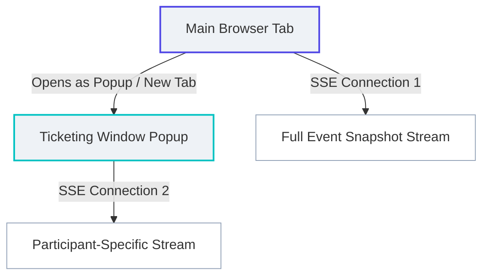

# 타임딜 시뮬레이터 프론트엔드 디자인 규격서 (디자인.md)

이 문서는 이력서 및 포트폴리오용 웹 애플리케이션으로서 채용 담당자에게 시각적 만족도와 전문성을 보여줄 수 있는 **깔끔하고 모던한 SaaS 스타일의 데스크톱 PC 웹(Web UX) 디자인 시스템**을 정의합니다.

기존의 어두운 해커/콘솔 스타일을 배제하고, 깔끔한 라이트 모드(Light Mode) 바탕에 신뢰감을 주는 로얄 인디고(Royal Indigo) 포인트를 사용하는 현대적인 데스크톱 웹 레이아웃을 채택합니다.

> [!IMPORTANT]
> **핵심 원칙**: 본 프로젝트의 메인 인터페이스는 모바일 앱이 아닌 **데스크톱 브라우저 기반의 PC 웹(Web UX)**입니다. 첨부된 이미지들은 UI 요소의 형태, 색상 배합, 그리고 비즈니스 로직 단계(좌석 선택 -> 결제 수단 선택 -> 주문 요약 영수증)의 레퍼런스로 사용하며, 이를 데스크톱 웹 화면에 최적화하여 구현합니다.

---

## 1. 분리형 2-윈도우 아키텍처 (2-Window Architecture)

실시간 데이터 동기화(SSE)의 성능 최적화와 브라우저 쓰로틀링(Throttling) 방지를 위해, 시스템은 두 개의 개별적인 데스크톱 웹 윈도우로 분리되어 구동됩니다.

1. **메인 대시보드 (`/`)**: 
   - **역할**: 백엔드 시스템 제어, 가상 유저(AI) 발생기 제어, 전체 성능 지표 모니터링.
   - **SSE 연결**: `/api/events/{eventId}/stream` (모든 가상 유저 상태 및 실시간 트래픽 데이터를 전송받는 헤비 스냅샷 스트림).
2. **예매 클라이언트 창 (`/ticketing/{eventId}`)**:
   - **역할**: 실제 구매자(인간)의 1인칭 관점 예매 프로세스 시뮬레이션.
   - **SSE 연결**: `/api/events/{eventId}/participants/{participantId}/stream` (특정 사용자의 대기 순번 및 진입 허가 이벤트만 수신하는 고성능 라이트 스트림).
   - **디자인 특징**: 모바일 폰 템플릿이 아닌, **가로로 넓고 시인성이 확보된 PC 웹용 예매 전용 카드 인터페이스**로 설계하여 팝업(900x700 이상) 혹은 새 탭에 어울리도록 구현합니다.

---

## 2. 디자인 시스템 및 디자인 토큰 (Design Tokens)

### 2.1. 색상 팔레트 (Color Palette)

| 구분 | 색상 코드 | 용도 | 설명 |
| :--- | :--- | :--- | :--- |
| **Primary Indigo** | `#4F46E5` | 브랜드 컬러 / 주 버튼 / 활성 헤더 | 로얄 인디고 (Royal Indigo) |
| **Teal Accent** | `#00C2C2` | 선택된 좌석 / 특수 하이라이트 | 테일/시안 블루 (`seatdesign.PNG` 레퍼런스) |
| **Success / Available**| `#10B981` | 예매 완료 / 정상 가이드라인 / 성공 배지 | 민트 그린 (Mint Green) |
| **Danger / Failed** | `#EF4444` | 예매 실패 / 서버 에러 / 만료 상태 | 소프트 레드 (Soft Red) |
| **Warning / Process** | `#F59E0B` | 결제 대기 중 / 결제 진행 중 상태 | 앰버 옐로우 (Amber Yellow) |
| **Seat Available** | `#E2E8F0` | 예매 가능한 좌석 배경 (`seatdesign.PNG` Light) | 연한 그레이 (Slate 200) |
| **Seat Booked** | `#334155` | 이미 매진된 좌석 배경 (`seatdesign.PNG` Light) | 다크 차콜 (Slate 700) |
| **Background Main** | `#F8FAFC` | 웹 대시보드 전체 배경 | 아주 연한 슬레이트 그레이 (Slate 50) |
| **Background Card** | `#FFFFFF` | 각 카드 및 예약 웹 패널 배경 | 순수 화이트 |
| **Border Line** | `#E2E8F0` | 카드 경계선, 그리드 경계선 | 연한 회색 (Slate 200) |
| **Text Primary** | `#0F172A` | 메인 헤딩, 강조 텍스트 | 딥 네이비 (Slate 900) |
| **Text Secondary** | `#475569` | 일반 본문 텍스트, 설명글 | 다크 그레이 (Slate 600) |
| **Text Tertiary** | `#94A3B8` | 캡션, 플레이스홀더, 비활성 아이콘| 라이트 그레이 (Slate 400) |

### 2.2. 타이포그래피 (Typography)
- **기본 글꼴**: `Inter`, `-apple-system`, `BlinkMacSystemFont`, `"Segoe UI"`, `Roboto`, `sans-serif`
- **글꼴 크기 및 두께 규격**:
  - **Heading 1**: `24px` / Bold (font-weight: 700) / 대시보드 및 예매 타이틀
  - **Heading 2**: `18px` / Semibold (font-weight: 600) / 섹션 타이틀
  - **Heading 3 / Body Bold**: `14px` / Semibold (font-weight: 600) / 카드 헤더 및 강조 본문
  - **Body Regular**: `14px` / Regular (font-weight: 400) / 일반 데이터 및 라벨
  - **Caption**: `12px` / Regular (font-weight: 400) / 부연 설명 및 메트릭 라벨

### 2.3. 레이아웃 컴포넌트 규칙
- **둥근 모서리 (Border Radius)**:
  - 대시보드 카드, 메인 컴포넌트: `12px`
  - 버튼, 인풋, 작은 배지: `6px` 또는 `8px`
- **그림자 효과 (Box Shadow)**:
  - 기본 카드: `box-shadow: 0 1px 3px rgba(15, 23, 42, 0.05);` (매우 미세하고 깨끗한 그림자)
  - 호버 또는 포커스 상태: `box-shadow: 0 4px 12px rgba(15, 23, 42, 0.08);`
- **여백 (Spacing)**:
  - 컴포넌트 간 간격: `24px` (`gap: 1.5rem` 또는 `margin-bottom: 1.5rem`)
  - 카드 내부 패딩: `20px` (`padding: 1.25rem`)

---

## 3. 화면별 상세 설계

### 3.1. 메인 대시보드 윈도우 (`/`) - 시스템 모니터링용 PC 웹
- **사이드 네비게이션**: 좌측에 슬림형 탭 메뉴 고정.
- **실시간 트래픽 & 서버 모니터링 그리드**:
  - **TPS 실시간 스플라인 라인 차트**: 갱신 주기마다 부드럽게 흘러가는 로얄 인디고 그라데이션 차트.
  - **Kafka Lag / Active Connections**: 수평 게이지 및 카운터 카드 디자인.
  - **로드밸런싱 및 분산 서버 상태**: 분산된 가상 인스턴스별 성능 부하 막대 그래프.
- **실시간 예매 현황판 (Read-Only Seat Map)**:
  - 우측에 널찍하게 구성된 좌석 모니터링판. 가상 유저(AI)에 의해 좌석들이 붉은색(`Booked`)으로 채워지는 과정을 관제.
- **예매 참여 제어반 (My Ticket Panel)**:
  - 채용 담당자가 직접 예매자로 시뮬레이션에 참여하기 위한 패널. "예매하기" 버튼 클릭 시 `/ticketing/{eventId}` 팝업창을 생성함.

### 3.2. 예매 클라이언트 윈도우 (`/ticketing/{eventId}`) - 팝업/독립형 PC 웹
- **설명**: 모바일 형식을 완전히 벗어난, **깔끔한 카드 기반의 데스크톱 예매 시스템 웹페이지**입니다. 넓은 화면 공간을 활용해 시원하고 직관적으로 정보를 표현합니다.
- **단계 인디케이터 (Step Indicator)**: 상단에 선명한 로얄 인디고 선으로 엮인 단계 노드 (`대기열 ➔ 좌석 선택 ➔ 결제 수단 ➔ 예매 영수증`).

#### ➔ 1단계: 예매 대기방 (Waiting Room Panel)
- **대기 순번 시각화**: 가로형 로딩 바와 함께 "대기열 진입 중... 현재 대기 번호: `245`번" 문구를 로얄 인디고 테마의 배지 형태로 강조.

#### ➔ 2단계: 좌석 선택 화면 (Choose Seat Web Panel)
- **좌석 맵 그리드 (`seatdesign.PNG` 레퍼런스)**:
  - 상단에 선명한 청록색(Teal) 라인과 함께 `Screen` 영역 표시.
  - 가로축(1~7번) 및 세로축(A~H열)을 깔끔한 청록색(`#00C2C2`) 텍스트로 라벨링.
  - 좌석은 둥글림 처리된 사각형(`border-radius: 4px`) 형태의 그리드 배치.
    - **예매 가능 (Available)**: 연한 그레이 색상 (`#E2E8F0`)
    - **예매 불가/매진 (Booked)**: 어두운 슬레이트/차콜 색상 (`#334155`)
    - **내가 선택한 좌석 (Selected)**: 선명한 청록색/테일 (`#00C2C2`)
  - **실시간 예매 인터랙션**: AI 가상 유저들이 뒷단에서 다른 좌석들을 예약하면, 실시간으로 해당 좌석들의 컬러가 변하는 연출을 적용하여 실재감 제공.
- **결제 요약 카드**: 우측 사이드에 부착된 카드로 선택된 좌석 명칭 및 가격을 표기하고 "결제 단계로 이동" 버튼 제공.

#### ➔ 3단계: 결제 수단 선택 화면 (Payment Method Web Panel)
- **목록 형태의 결제 옵션 (`design.PNG` 레퍼런스)**:
  - **Account Balance (가상 계좌 잔액)**, **Credit Card (VISA)** 등의 수단을 둥근 라디오 선택 바 형태로 깔끔하게 나열.
  - 잔액 부족 시의 에러 표시 텍스트 디자인 반영.

#### ➔ 4단계: 주문 완료 영수증 화면 (Order Summary Web Panel)
- **영수증 요약 카드 (`design.PNG` 레퍼런스)**:
  - 콘서트 타이틀 정보와 예매자 이름, 좌석 번호, 최종 결제 총액을 기재.
  - 영수증 상단과 하단을 연결하는 실선 점선 패턴(`border-top: 2px dashed #E2E8F0`)을 구현하여 포인트를 줌.

---

## 4. 프론트엔드 개선 구현 핵심 과제 (Next Steps)
1. **CSS 전면 개편**: `src/styles.css`에 위 디자인 시스템 토큰을 변수로 정의하고 ad-hoc 클래스를 모두 리팩토링합니다.
2. **독립 팝업 윈도우 스타일링**: `TicketingWindow.tsx`가 독립된 데스크톱 웹 윈도우 크기(가로/세로 비율)에서 완벽히 균형 잡힌 카드 그리드로 표현되도록 CSS Grid를 사용합니다.
